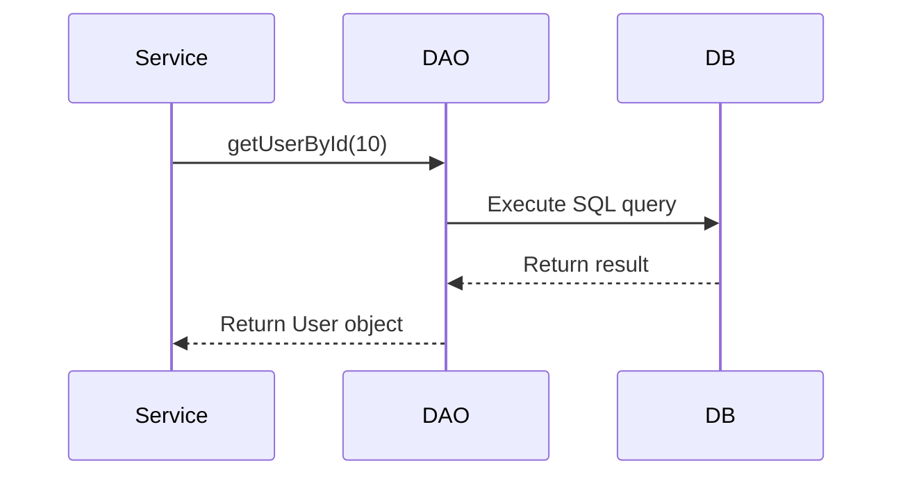

# ❗ **Problem Statement**

When building applications that interact with a database directly inside the business logic, several problems occur:

### **1. Tight coupling**

Business logic and database logic become mixed:

```java
// Bad: SQL inside service class
public User getUser(int id) {
    Connection conn = ...
    PreparedStatement ps = conn.prepareStatement("SELECT * FROM users WHERE id=?");
}
```

If the database changes, **every layer breaks.**

---

### **2. Hard to test**

Unit testing becomes difficult because the code depends on the database every time.

---

### **3. Hard to maintain**

Every module has SQL queries inside it → messy and unmanageable.

---

### **4. Code duplication**

Repeated database code (open connection, close connection, CRUD operations).

---

### 📌 **Conclusion:**

We need a design pattern that **isolates database operations** in one place → This is where **DAO Pattern** comes in.

---

# 🏛 **What Is the DAO Pattern?**

**DAO (Data Access Object)** is a design pattern that abstracts and encapsulates all access to a data source (database, file, external service).

It provides:

- A clean API for the rest of the application
    
- Isolation of business logic from database details
    
- Easier testing and maintenance
    

### 🔍 Simple definition:

> A DAO is a class responsible for interacting with the database and performing CRUD operations.

### Example:

```java
public interface UserDAO {
    User getUserById(int id);
    List<User> getAllUsers();
    void saveUser(User user);
    void deleteUser(int id);
}
```

---

# 🧩 **DAO Pattern Elements**

|Element|Description|
|---|---|
|**DAO Interface**|Declares CRUD operations|
|**DAO Implementation**|Contains JDBC code to interact with DB|
|**Model/Entity**|Represents the database table as a Java object|
|**DTO (optional)**|Data transfer object for communication|
|**Service Layer**|Uses DAO to perform business logic|
|**Database**|Actual data store|

---

# 🔄 **DAO Pattern Sequence Diagram**

Below is a **Mermaid diagram** compatible with Obsidian:



This shows:

- Service calls DAO
    
- DAO queries DB
    
- DB returns data
    
- DAO converts DB rows → Java objects
    
- DAO returns result to service layer
    

---

# 📦 **What is DTO?**

**DTO (Data Transfer Object)** is a simple Java object used to transfer data between layers.

### Characteristics:

- Contains only fields + getters/setters
    
- No business logic
    
- Not tied to the database schema
    

### Example DTO:

```java
public class UserDTO {
    private int id;
    private String name;
    private String email;
}
```

### When is DTO used?

- When returning data to UI
    
- When passing structured data between layers
    
- When exposing REST APIs
    

DTO ≠ Entity  
Entity maps database rows; DTOs shape data for consumption.

---

# 🟢 **DAO Pattern – Real Live Demo Example**

We build a simple system to manage **Users**.

---

## 1️⃣ **User Model (Entity)**

```java
public class User {
    private int id;
    private String name;
    private String email;

    // Constructors, getters, setters...
}
```

---

## 2️⃣ **DAO Interface**

```java
public interface UserDAO {
    User getUserById(int id);
    List<User> getAllUsers();
    void insertUser(User user);
    void updateUser(User user);
    void deleteUser(int id);
}
```

---

## 3️⃣ **DAO Implementation (JDBC Code)**

```java
public class UserDAOImpl implements UserDAO {

    private Connection conn;

    public UserDAOImpl(Connection conn) {
        this.conn = conn;
    }

    @Override
    public User getUserById(int id) {
        try {
            PreparedStatement ps = conn.prepareStatement(
                "SELECT * FROM users WHERE id = ?"
            );
            ps.setInt(1, id);

            ResultSet rs = ps.executeQuery();
            if (rs.next()) {
                return new User(
                    rs.getInt("id"),
                    rs.getString("name"),
                    rs.getString("email")
                );
            }
        } catch (SQLException e) {
            e.printStackTrace();
        }
        return null;
    }

    @Override
    public List<User> getAllUsers() {
        List<User> list = new ArrayList<>();
        try {
            Statement stmt = conn.createStatement();
            ResultSet rs = stmt.executeQuery("SELECT * FROM users");

            while (rs.next()) {
                list.add(new User(
                    rs.getInt("id"),
                    rs.getString("name"),
                    rs.getString("email")
                ));
            }
        } catch (SQLException e) {
            e.printStackTrace();
        }
        return list;
    }

    @Override
    public void insertUser(User user) {
        try {
            PreparedStatement ps = conn.prepareStatement(
                "INSERT INTO users(name, email) VALUES(?, ?)"
            );
            ps.setString(1, user.getName());
            ps.setString(2, user.getEmail());
            ps.executeUpdate();
        } catch (SQLException e) {
            e.printStackTrace();
        }
    }

    @Override
    public void updateUser(User user) {
        try {
            PreparedStatement ps = conn.prepareStatement(
                "UPDATE users SET name=?, email=? WHERE id=?"
            );
            ps.setString(1, user.getName());
            ps.setString(2, user.getEmail());
            ps.setInt(3, user.getId());
            ps.executeUpdate();
        } catch (SQLException e) {
            e.printStackTrace();
        }
    }

    @Override
    public void deleteUser(int id) {
        try {
            PreparedStatement ps = conn.prepareStatement(
                "DELETE FROM users WHERE id=?"
            );
            ps.setInt(1, id);
            ps.executeUpdate();
        } catch (SQLException e) {
            e.printStackTrace();
        }
    }
}
```

---

## 4️⃣ **Service Layer Using DAO**

```java
public class UserService {

    private UserDAO userDAO;

    public UserService(UserDAO userDAO) {
        this.userDAO = userDAO;
    }

    public void registerUser(User user) {
        System.out.println("Validating user...");
        userDAO.insertUser(user);
    }

    public User findUser(int id) {
        return userDAO.getUserById(id);
    }
}
```

---

## 5️⃣ **Demo Main Program**

```java
public class Main {
    public static void main(String[] args) throws Exception {

        Connection conn = DriverManager.getConnection(
            "jdbc:mysql://localhost:3306/demo",
            "root",
            "1234"
        );

        UserDAO dao = new UserDAOImpl(conn);
        UserService service = new UserService(dao);

        // Insert new user
        User u = new User(0, "Ahmed", "ahmed@gmail.com");
        service.registerUser(u);

        // Fetch and print users
        List<User> users = dao.getAllUsers();
        users.forEach(usr -> {
            System.out.println(usr.getId() + " - " + usr.getName());
        });
    }
}
```

---

# 💡 **Benefits of DAO Pattern**

|Benefit|Why it's useful|
|---|---|
|**Separation of Concerns**|Database logic is isolated|
|**Easier maintenance**|SQL is centralized|
|**Easier unit testing**|DAO can be mocked|
|**Better code organization**|Cleaner service/business logic|
|**Supports switching databases**|Only DAO layer changes|

---

# 🎯 **Quick Summary**

- DAO pattern isolates database logic from business logic.
    
- DAO includes: interface, implementation, model/entity, DB connection.
    
- DTO is a transport object used between layers.
    
- Sequence diagram: Service → DAO → DB → DAO → Service.
    
- Real example demonstrates full CRUD with JDBC.
    
